# 通过修改注册表添加右键菜单

## 方法如下：

+ 首先按Win+R打开运行，输入regedit打开注册表编辑

  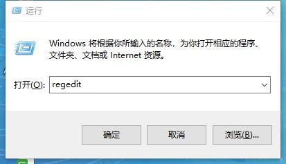
+ 然后依次展开 HKEY_CLASSES_ROOT\Directory\Background\shell，然后新建一个项，名字随便写，我这里写的Terminal_here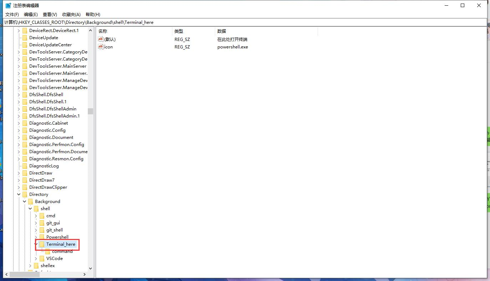
+ 然后看右面有一个键叫 (默认)，双击它，在弹出的对话框里输入你要在右键菜单里显示的名称，我这里写的 在此处打开终端
  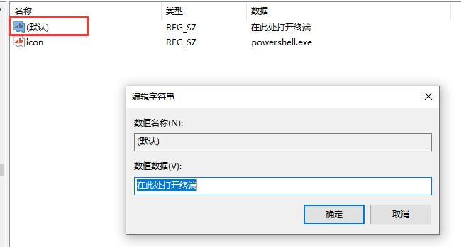
+ 然后在空白处右键，选新建——字符串项

  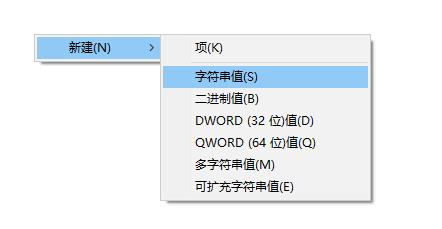
+ 命名为icon，这一项的图标的信息，不要这一项也没关系，只不过就没有图标

  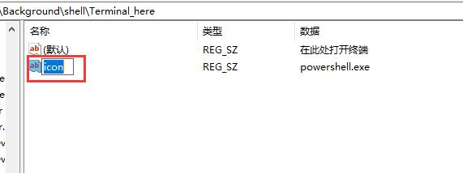
+ 双击icon编辑图标文件的路径，我这里直接使用powershell.exe的图标

  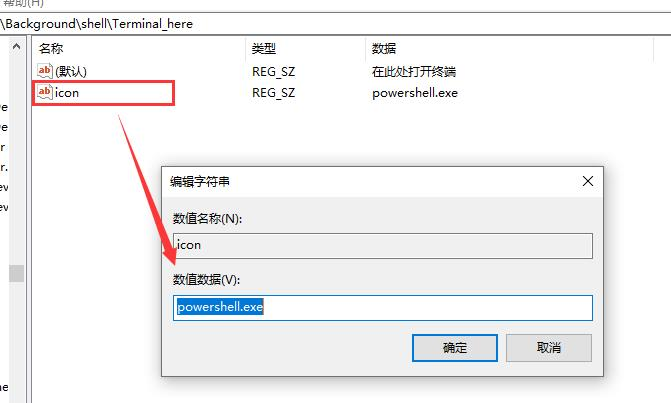
+ 然后在注册表左侧选中你刚才建的那个项，右键——新建——项

  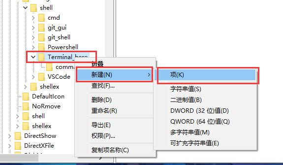
+ 新建的项命名为command

  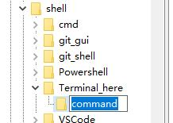
+ 然后双击右侧的（默认）键，在弹出的对话框中输入对应的命令，我这里输入的是powershell是打开的WindowsPowershell，当然也可以输入cmd打开的就是cmd的窗口

  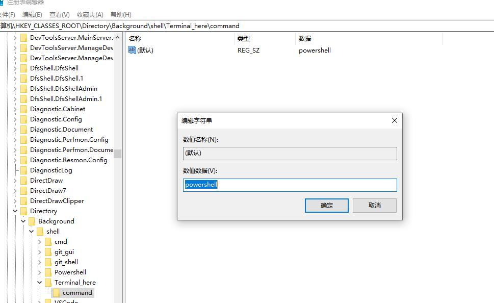
+ 完成，关闭注册表编辑器然后随便打开一个文件夹右键则会弹出这么一个选项

  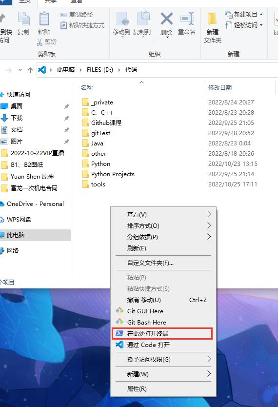
+ 点击后则会打开powershell

  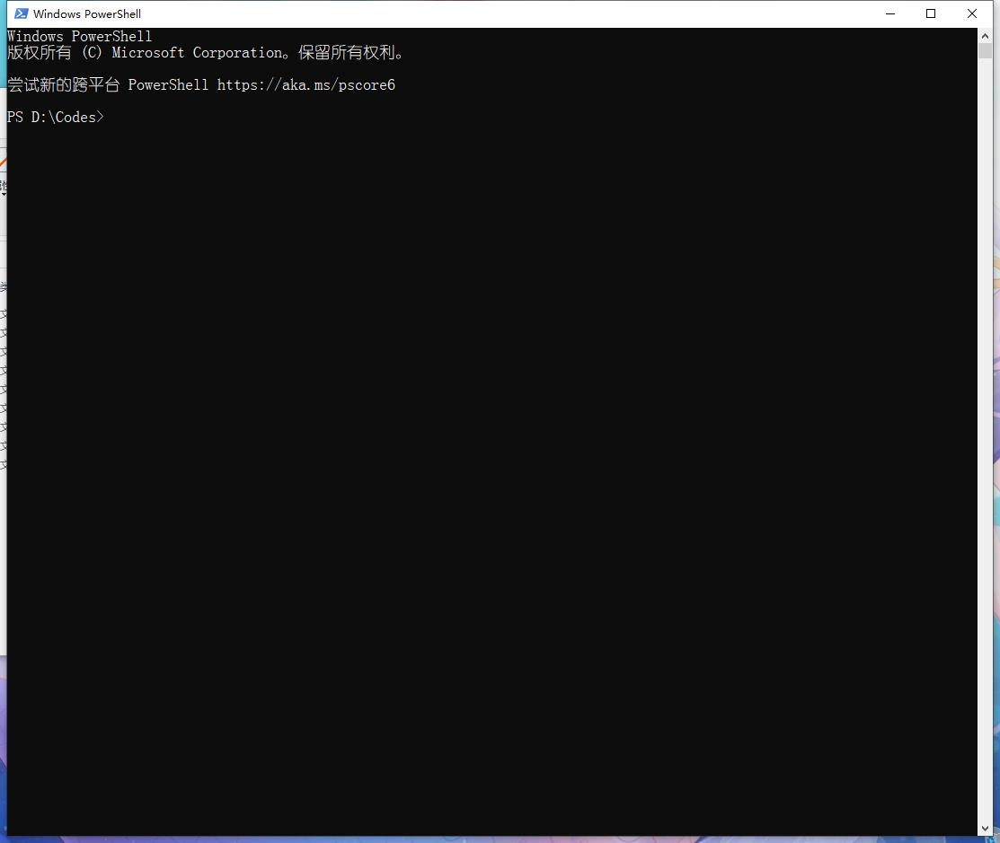
+ 搞定！！
