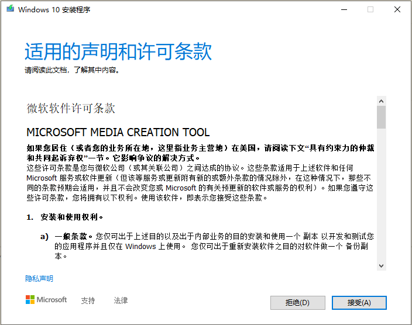
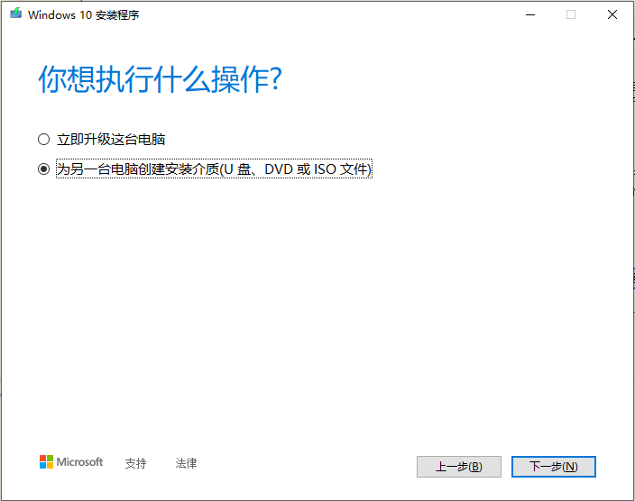
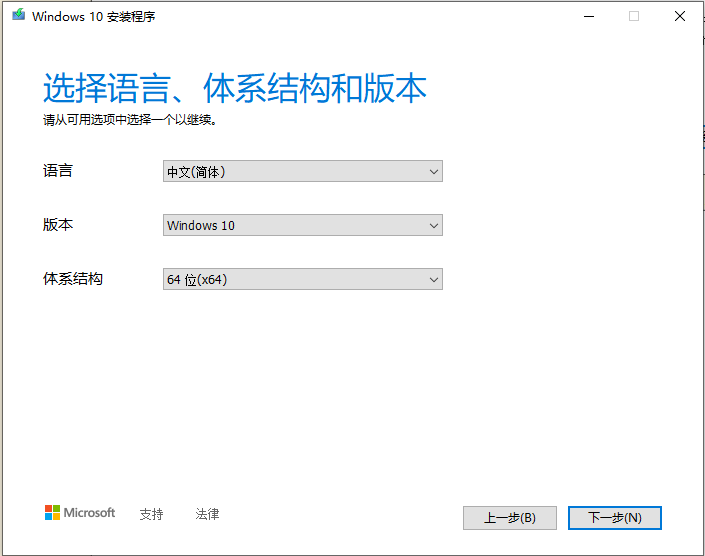
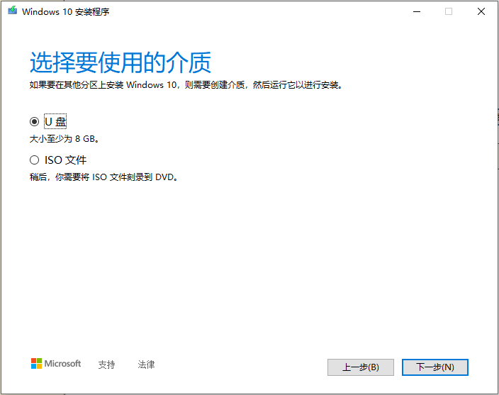
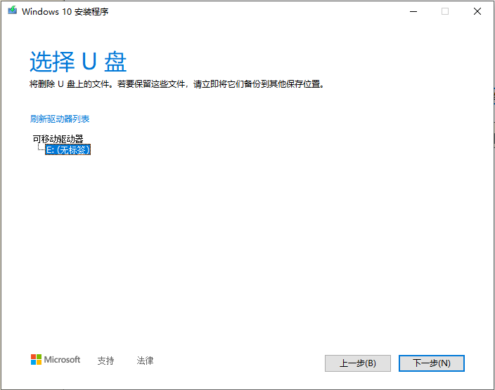
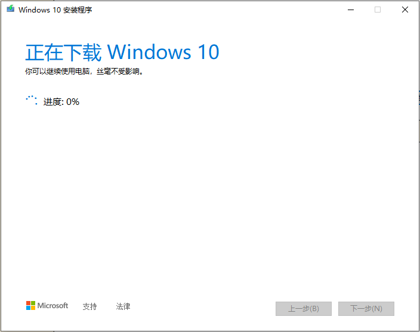
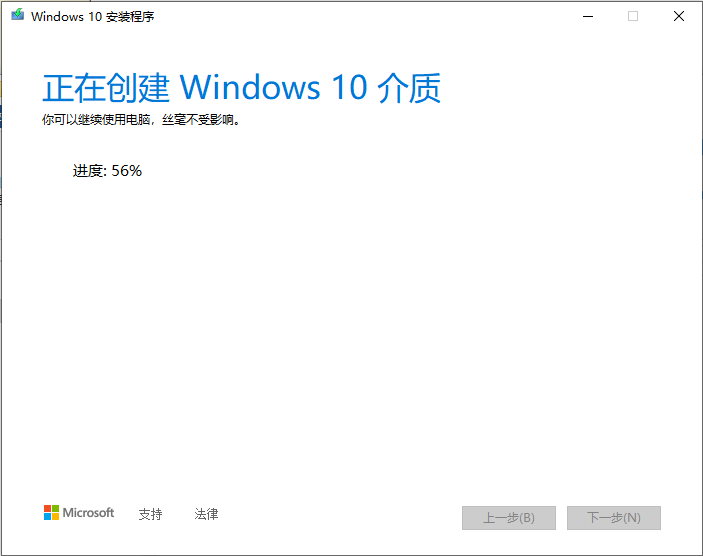
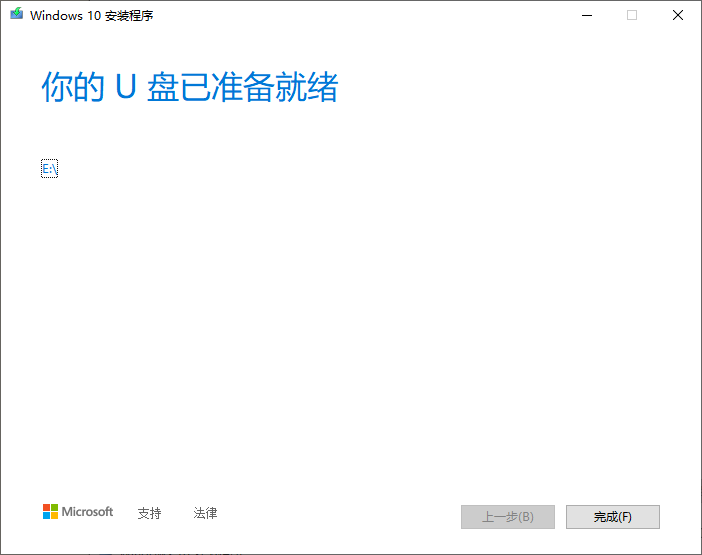

<!--
 * @作  者    : 北极星光 light22@126.com
 * @创建时间  : 2023-03-25 01:30:30
 * @最后编辑  : 2023-03-25 01:30:32
 * @编辑人    : 北极星光
-->

# Windows10系统U盘启动安装盘制作方法

## 一、制作前准备：

+ U盘容量8G以上一个
+ 可以联网电脑一台

## 二、操作步骤：

+ 双击运行MediaCreationTool22H2.exe，稍等片刻出现以下界面，点【接受(A)】。
+ 稍等片刻后出现以下界面，选择【为另一台电脑创建安装介质(U盘、DVD或ISO文件)】，然后点击【下一步(N)】。
+ 选择语言、版本和结构体系（默认不用动即可），然后点击【下一步(N)】。
+ 选择要使用的介质，这里选择【U 盘】，此时请确保你的U盘已插在电脑上，然后点击【下一步(N)】。
+ 然后会弹出选择U盘的界面，选择你插入的U盘，然后点击【下一步(N)】。
+ 程序会自动从官网上下载镜像文件并刻录在你的U盘上，需要一段时间，请耐心等待。
+ 点击【完成(F)】完成制作。大功告成，祝你装机顺利
